# Infinium Methylation Data Analysis

This project, conducted for the exam of DNA/RNA Dynamics, focuses on analyzing Infinium methylation data using R.

Note: The README file includes code snippets, result interpretations, and various plots. For complete code details, please refer to `code.R`.

## Table of Contents
1. [Introduction](#introduction)
2. [Data Preparation](#data-preparation)
3. [Preprocessing and Normalization](#preprocessing-and-normalization)
4. [Visualization and Analysis](#visualization-and-analysis)
5. [Conclusions](#conclusions)

## Introduction

This pipeline is designed to analyze DNA methylation data obtained from the Illumina HumanMethylation450 BeadChip platform, which is widely used for genome-wide methylation studies. The Infinium assay provides insights into DNA methylation patterns.

This repository provides a comprehensive pipeline for processing, analyzing, and interpreting methylation data generated by the Infinium platform.

### Workflow Overview
- *Quality Control:* assess data quality to identify potential issues or biases.
- *Preprocessing:* apply normalization techniques to reduce technical variations and batch effects.
- *Differential Methylation Analysis:* identify differentially methylated regions (DMRs) or CpG sites associated with specific conditions or phenotypes.
- *Visualization:* create informative plots and tables to visualize DNA methylation patterns and results.

## Data Preparation

### 0. Libraries
The `minfi` package in R is utilized for analyzing methylation data from Infinium methylation arrays. It handles raw data, quality control, preprocessing, and subsequent analyses. Other libraries serve specific roles in data analysis, visualization, and genomic research.

```r
# Load necessary libraries
library(minfi)
library(IlluminaHumanMethylation450kmanifest)
library(IlluminaHumanMethylationEPICmanifest)
library(IlluminaHumanMethylationEPICanno.ilm10b2.hg19)
library(knitr)
library(dplyr)
library(qqman)  
library(gplots)
library(ggplot2)
library(viridis)
```

### 1. Load Raw Data

Start by loading the raw data files containing intensity values for methylated and unmethylated probes across samples. This initial step ensures the data is properly formatted for subsequent analyses.

```r
# Load raw data
baseDir <- ('Input')
targets <- read.metharray.sheet(baseDir)
RGset <- read.metharray.exp(targets = targets)
```

### 2. Create R/G Dataframes

Separate the raw intensity data into red and green channels. This distinction helps in identifying the chemistry of the probes and is essential for analyzing the fluorescence signals accurately.

```r
# Create R/G dataframes
Red <- data.frame(getRed(RGset))
Green <- data.frame(getGreen(RGset))
dim(Red)            ## [1] 622399      8
dim(Green)          ## [1] 622399      8
```

### 3. Check Probe Info by Address

To determine the probe type, refer to the manifest file from Illumina, which categorizes probes into Type I or Type II. This classification is important because Type II probes use only one color channel, whereas Type I probes use both.

```r
# Check probe info by address
address <- "39802405"
load("Illumina450Manifest_clean.RData")
probe_type = Illumina450Manifest_clean[Illumina450Manifest_clean$AddressA_ID==address, 'Infinium_Design_Type']
```
```r
## [1] II
## Levels: I II
```

```r
# Create and fill the fluorescence_data dataframe

if (address %in% rownames(Red) & address %in% rownames(Green)) 
    Red_fluor <- Red[address, ]
    Green_fluor <- Green[address, ]

fluorescence_data <- data.frame(
  Sample = colnames(Red),
  Red_fluor = Red_fluor,
  Green_fluor = Green_fluor,
  Type = probe_type,
  Color = 'NA'
)
fluorescence_data$Sample <- sapply(strsplit(rownames(fluorescence_data), "_"), `[`, 2)
rownames(fluorescence_data) <- NULL
```

```r
|Sample | Red_fluor| Green_fluor|Type |Color |
|:------|---------:|-----------:|:----|:-----|
|R01C01 |      4254|        8361|II   |NA    |
|R02C01 |      4584|       10343|II   |NA    |
|R03C01 |      4201|        9859|II   |NA    |
|R04C01 |      3627|        8552|II   |NA    |
|R02C02 |      5669|        1003|II   |NA    |
|R03C02 |      7689|        1041|II   |NA    |
|R04C02 |      5954|        6336|II   |NA    |
|R05C02 |      5989|         761|II   |NA    |
```
Notice that the assigned probes are of Infinium II design, hence no color channel needs to be specified since type II probes use a single bead type for both methylated and unmethylated states and measure the intensities of the two states using the same color channel. As a result, Type II probes do not require separate color information for the red or green channels because they are not differentiated by color.

### 4. Create the Object MSet.raw

The `MSet.raw` object contains methylated and unmethylated signal intensities, facilitating further analysis of methylation levels. 

```r
# Create MSet.raw object
MSet.raw <- preprocessRaw(RGset)
```

## Preprocessing and Normalization

### 5. Quality Check

The main goal of quality checks is to assess the overall data quality and identify any potential issues or biases that could affect the accuracy and interpretability of methylation data.

##### 5.1 QCplot

QCplot visualizes the median intensities of methylation and unmethylation signals. High median values in both distributions indicate good data quality. However, the plot has limitations, such as not accounting for background signals or potential sample preparation failures.
The plot shows clustering of samples with high median values, indicating good quality data. Low median values suggest poor quality, which can affect downstream analyses.

```r
# Quality check
qc <- getQC(MSet.raw)
plotQC(qc)
```
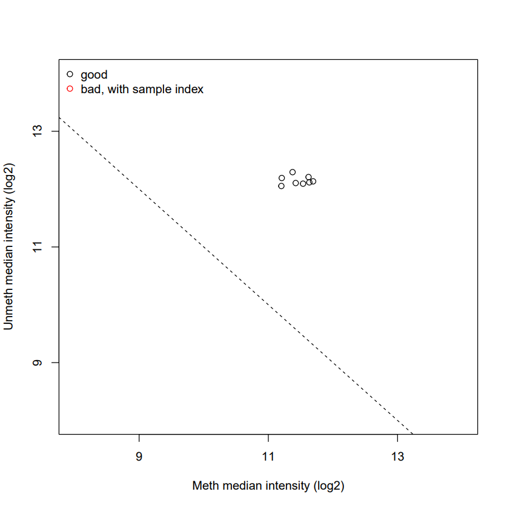

##### 5.2 Negative control intensity check

Negative control probes estimate system background intensity. Normally, these values range from 100 to 1000 units. High values may indicate degraded DNA, affecting data quality. Using controlStripPlot(), we can check the intensity levels, with higher values indicating potential issues.

```r
controlStripPlot(RGset, controls="NEGATIVE")
```
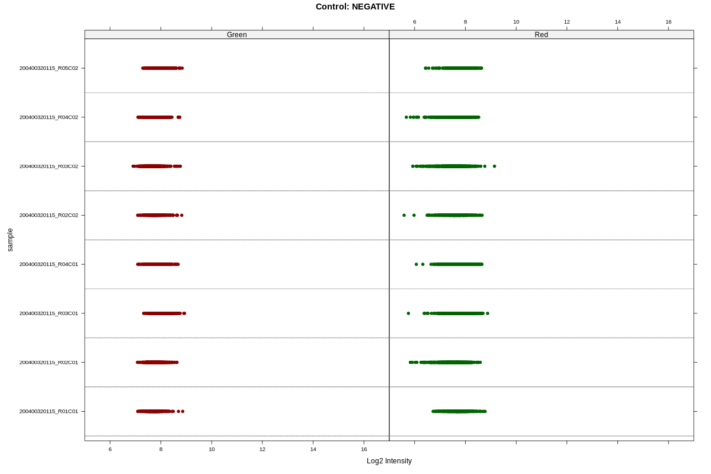
Intensity values below 1000 units (log2(1000) = 10) indicate low background noise and reliable signals.

##### 5.3 Failed positions

Failed percentage analysis assesses the proportion of probes that fail to meet predefined quality criteria, such as detection thresholds. Each probe's detection p-value indicates the confidence level of its measured intensity. Since the threshold is set at 0.05, probes with detection p-values greater than 0.05 are considered failed or not confidently detected.

```r
# Calculate detection pValues
detP <- detectionP(RGset) 
threshold <- 0.05
failed <- detP > threshold
failed_positions <- colSums(failed)

# Summarize failed positions per sample
failed_positions_summary <- data.frame(
  Sample = colnames(failed),
  n_Failed_positions = colSums(failed),
  percentage_failed = colMeans(failed)*100
)
failed_positions_summary$Sample <- sapply(strsplit(rownames(failed_positions_summary), "_"), `[`, 2)
rownames(failed_positions_summary) <- NULL

kable(failed_positions_summary)
```

Most of these samples have very low percentages of failed probes, indicating high data quality.

```r
|Sample | n_Failed_positions| percentage_failed|
|:------|------------------:|-----------------:|
|R01C01 |                 45|         0.0092686|
|R02C01 |                 26|         0.0053552|
|R03C01 |                 28|         0.0057671|
|R04C01 |                 32|         0.0065910|
|R02C02 |                190|         0.0391339|
|R03C02 |                130|         0.0267759|
|R04C02 |                 17|         0.0035015|
|R05C02 |                406|         0.0836231|
```

### 6. Beta and M Values

Methylation levels are continuous values between 0 and 1, obtained from fluorescence intensities. These levels can be represented as:

- **Beta Values (β-values)**: Represent the proportion of methylation at a CpG site (0 to 1).
  - Formula: $\( \beta = \frac{M}{M + U} \)$

- **M Values (M-values)**: Log-transformed ratios of methylated to unmethylated intensities.
  - Formula: $\( M = \log_2 \frac{M}{U} \)$

From these formulas, the conversion between Beta and M values can be derived as:

- $\( \beta_i = \frac{2^{M_i}}{2^{M_i} + 1} \)$
- $\( M_i = \log_2 \left( \frac{\beta_i}{1 - \beta_i} \right) \)$

```r
# Calculate Beta and M values
beta <- getBeta(MSet.raw)
M <- getM(MSet.raw)
```

Both WT and MUT groups show similar distribution patterns in Beta and M values, indicating bimodal distributions (peaks around 0.1 and 0.9 for Beta values). The similarity in distributions suggests no significant overall differences in methylation levels between WT and MUT groups, however, the central values in the WT group are slightly lower and the peaks values are slightly higher.

### 7. Functional Normalization

Normalization in methylation analysis is crucial for adjusting technical variations across samples, ensuring accurate biological comparisons. SWAN (Subset-quantile Within Array Normalization) extends standard methods like quantile normalization by integrating known covariates that capture unwanted technical variability. Specifically, for Illumina Infinium HumanMethylation450k arrays, SWAN utilizes principal components derived from control probes to selectively correct technical biases while preserving biological variability.

The resulting output from SWAN normalization typically includes a plot with 6 panels. Each panel contrasts raw and normalized data, featuring:
- Density plots depicting beta mean values categorized by probe chemistry.
- Density plots illustrating beta standard deviation values based on probe chemistry.
- Boxplots showing the distribution of beta values across samples.

This approach ensures that methylation data reflects meaningful biological differences rather than being obscured by technical artifacts, thereby enhancing the reliability of research findings and clinical interpretations in DNA methylation studies.

```r
# Apply SWAN normalization
RGSet_SWAN <- preprocessSWAN(RGset)
beta_SWAN <- getBeta(RGSet_SWAN)
```

```r
# Filter Infinium I and II data
dfI <- Illumina450Manifest_clean %>% filter(Infinium_Design_Type == "I") %>% droplevels()
dfII <- Illumina450Manifest_clean %>% filter(Infinium_Design_Type == "II") %>% droplevels()
```
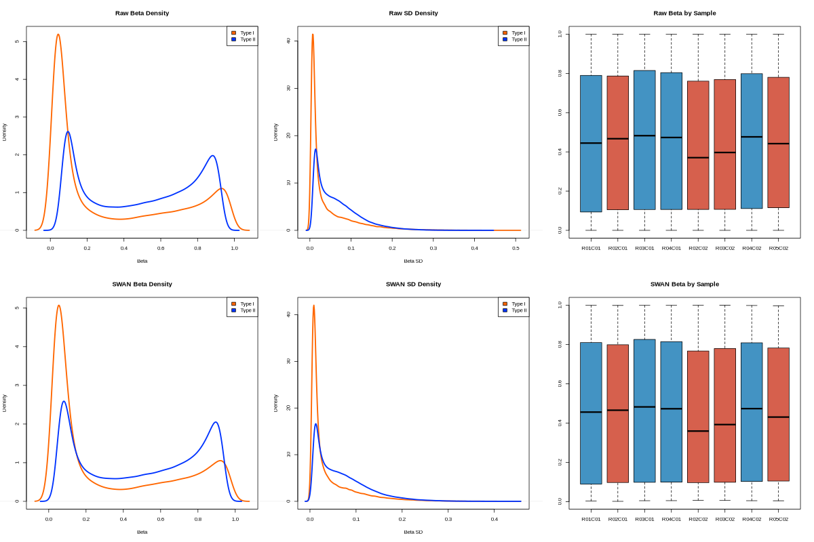
Functional Normalization led to noticeable changes: initially, the mean density of the raw data highlighted distinct differences between the two probe types, whereas post-normalization, these differences diminished, resulting in more overlap. Examining the boxplot, the raw data exhibited greater variability compared to the normalized data. Furthermore, after normalization, the median and first quartile (Q1) values shifted towards lower values.

### 8. PCA

Principal Component Analysis (PCA) reduces data dimensionality and helps visualize sample clustering. On the X and Y axes there are the Principal Components (PCs) explaining most variance.
Clustering of samples indicates similarity, while separation between groups (e.g., WT vs. MUT) along principal components suggests significant differences.

```r
# Perform PCA
pca_results <- prcomp(t(beta_SWAN), scale. = TRUE)
```
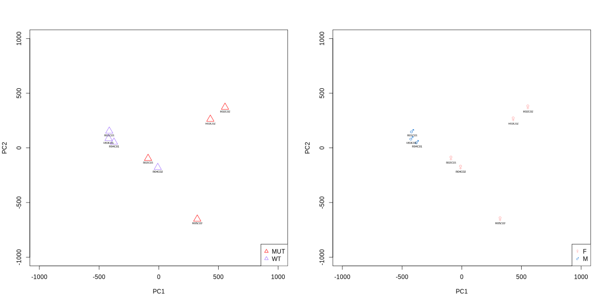
The groups primarily segregate based on PC1, where most of the wild types (WTs) have lower PC1 values compared to mutants (MUTs), which predominantly occupy the higher PC1 range. While WTs form a cohesive cluster also considering PC2, MUTs show varying PC2 values, except for R02C02 and R03C02, which cluster closely together. Notably, R02C01, despite being a MUT, clusters with the WTs. PC1 also reveals a clear separation by sex on the graph. Males cluster tightly together across PC1 and PC2, whereas females exhibit three distinct clusters dispersed across different PC2 levels.

```r
var_explained <- pca_results$sdev^2 / sum(pca_results$sdev^2) * 100

eig_df <- data.frame(
  PC = seq_along(var_explained),
  Variance = var_explained
)
```
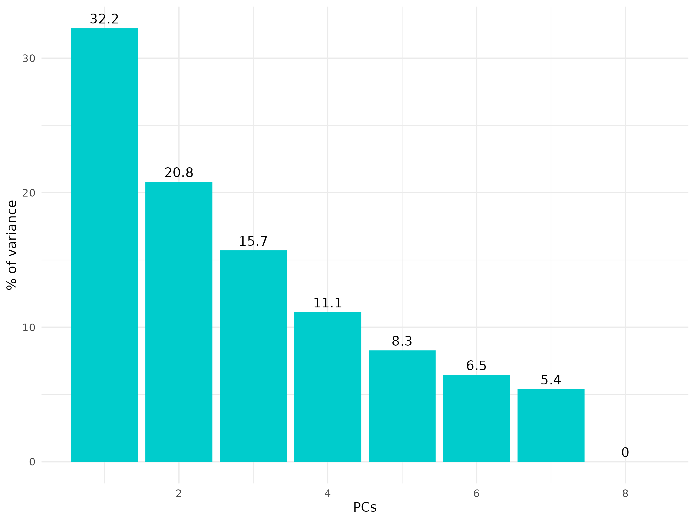
Notice that the first two PCs explain the 53.1% of the variance.

## Visualization and Analysis

### 9. Differential Methylation Analysis

We identify differentially methylated positions (DMPs) between WT and MUT groups.
Differential Methylation Analysis aims to identify changes in DNA methylation patterns between different conditions; DNA methylation, primarily occurring at CpG sites, can regulate gene expression and by comparing methylation levels between groups, it's possible to uncover epigenetic changes associated with diseases or other conditions.

```r
# Define the Mann-Whitney test function
mann_whitney_function <- function(x) {
  mw_test <- wilcox.test(x ~ samplesheet$Group)
  return(mw_test$p.value)
}

# Apply the Mann-Whitney test function to each row
pValues_mw <- apply(beta_SWAN, 1, mann_whitney_function)

# Create a data frame with beta_SWAN values and p-values
final_mw <- data.frame(beta_SWAN, pValues_mw)
final_mw <- final_mw[order(final_mw$pValues_mw),]

kable(head(final_mw))
```

```r
|           |    R01C01|    R02C01|    R03C01|    R04C01|    R02C02|    R03C02|    R04C02|    R05C02| pValues_mw|
|:----------|---------:|---------:|---------:|---------:|---------:|---------:|---------:|---------:|----------:|
|cg00213748 | 0.2817402| 0.3407055| 0.2067676| 0.2236526| 0.4028662| 0.5231608| 0.1565621| 0.5665209|  0.0285714|
|cg03695421 | 0.6034216| 0.5274061| 0.5557625| 0.6064900| 0.3585165| 0.3829868| 0.5724094| 0.4791914|  0.0285714|
|cg03750315 | 0.0376477| 0.0840457| 0.0790058| 0.0486865| 0.4055088| 0.5794807| 0.0835519| 0.6151685|  0.0285714|
|cg04462340 | 0.5819596| 0.6274705| 0.6153685| 0.5920996| 0.6508689| 0.7705017| 0.5705601| 0.7360328|  0.0285714|
|cg05865243 | 0.9349324| 0.8893957| 0.9298641| 0.9289065| 0.8537726| 0.7612493| 0.9139275| 0.4217573|  0.0285714|
|cg07939587 | 0.9095799| 0.8335510| 0.9359694| 0.9051271| 0.9045411| 0.7254902| 0.9313836| 0.5163043|  0.0285714|
```
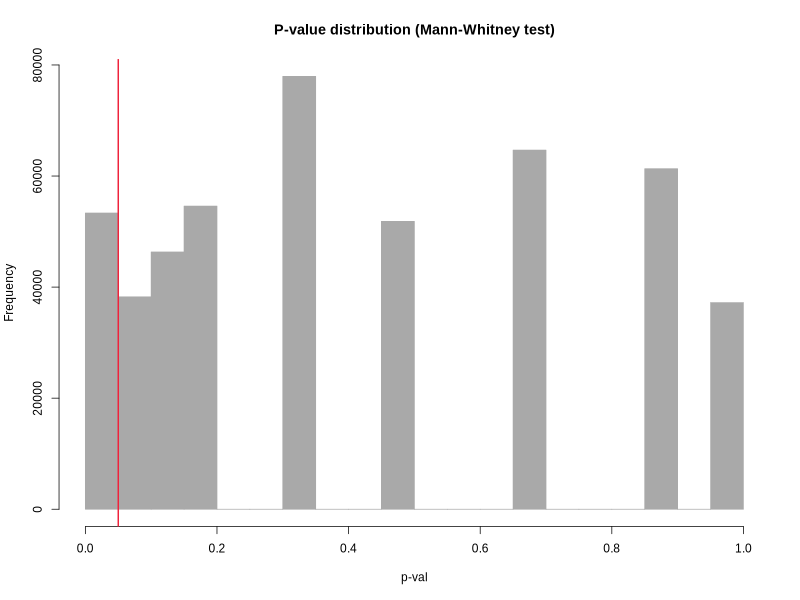
SWAN (Subset-quantile Within Array Normalization) is a non-parametric normalization method. It does not assume a specific distribution of the data but instead adjusts for technical biases by aligning subsets of the data (quantiles) within each array. These values are discrete because they represent the probability of observing the data under the null hypothesis, computed at specific points and not as a continuous distribution.

### 10. Multiple Test Correction

When conducting numerous statistical tests, some will show significance just by chance. Multiple test correction methods adjust p-values to control for this:

- Bonferroni Correction: divides the significance threshold by the number of tests. It's very stringent and can reduce false positives but increase false negatives.
- Benjamini-Hochberg (BH) Correction: controls the false discovery rate (FDR), balancing false positives and false negatives. It’s less stringent than Bonferroni.

```r
# Multiple test correction
corr_pValues_Bonf <- p.adjust(final_mw$pValues_mw, "bonferroni")
corr_pValues_BH <- p.adjust(final_mw$pValues_mw, "BH")
final_mw_corr <- data.frame(final_mw, corr_pValues_Bonf, corr_pValues_BH)

before_corr <- nrow(final_mw[final_mw$pValues_mw <= 0.05,])
after_Bonf <- nrow(final_mw[final_mw$corr_pValues_Bonf <= 0.05,])
after_BH <- nrow(final_mw_corr[final_mw_corr$corr_pValues_BH <= 0.05,])

diff_meth_probes <- data.frame(before_corr, after_Bonf, after_BH)
rownames(diff_meth_probes) <- c("Differentially methylated probes")

kable(diff_meth_probes)
```
There were 53343 probes identified as differentially methylated. However, after correcting for multiple testing using both Bonferroni and BH methods, none of these probes remained statistically significant. This outcome suggests that the initial findings of differential methylation were likely due to chance or false positives.
```r
|                                 | before_corr| after_Bonf| after_BH|
|:--------------------------------|-----------:|----------:|--------:|
|Differentially methylated probes |       53343|          0|        0|
```
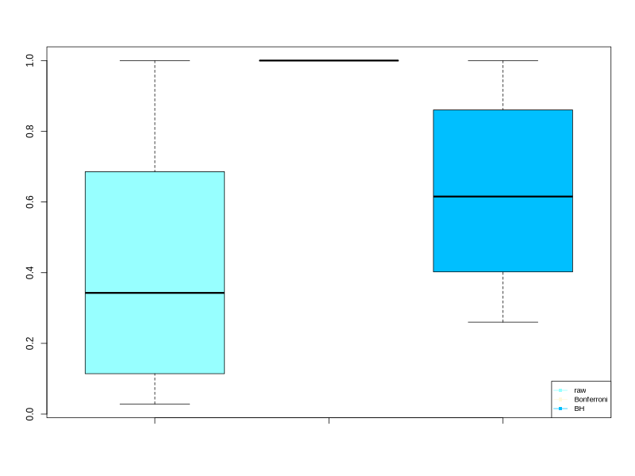

### 11. Volcano and Manhattan Plots

Visualize DMPs with volcano and Manhattan plots.

##### 11.1 Volcano plot
Combines fold change and significance to highlight differentially methylated probes.

X-axis: Log2 fold change (difference in methylation between groups)
Y-axis: -log10(p-value) (statistical significance)

Points with large fold changes and high significance appear in the upper left and right corners, while non-significant points are near the bottom.

```r
# WT and MUT group means
WT_group <- final_mw_corr[, targets$Group == "WT"]
MUT_group <- final_mw_corr[, targets$Group == "MUT"]
mean_WT_group <- apply(WT_group, 1, mean)
mean_MUT_group <- apply(MUT_group, 1, mean)

# Compute delta
delta <- mean_WT_group - mean_MUT_group

#create a dataframe
toVolcPlot <- data.frame(delta, -log10(final_mw_corr$pValues_mw))
kable(head(toVolcPlot))
```

```r
|           |      delta| X.log10.final_mw_corr.pValues_mw.|
|:----------|----------:|---------------------------------:|
|cg00213748 | -0.3737603|                          1.544068|
|cg03695421 | -0.1118362|                          1.544068|
|cg03750315 | -0.4472554|                          1.544068|
|cg04462340 | -0.3155401|                          1.544068|
|cg05865243 | -0.1191932|                          1.544068|
|cg07939587 | -0.1341973|                          1.544068|
```
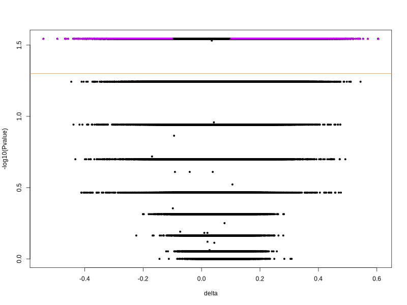

##### 11.2 Manhattan Plot
Displays p-values across the genome.

X-axis: Genomic coordinates
Y-axis: -log10(p-value)

Peaks indicate genomic regions with significant differential methylation, while horizontal lines show significance thresholds.

```r
final_mw_corr_df <- data.frame(IlmnID = rownames(final_mw_corr), final_mw_corr)
final_mw_corr_ann <- merge(final_mw_corr_df, Illumina450Manifest_clean, by = "IlmnID")

input_Manhattan <- data.frame(id = final_mw_corr_ann$IlmnID, 
                              chr = final_mw_corr_ann$CHR, 
                              map = final_mw_corr_ann$MAPINFO, 
                              pval = final_mw_corr_ann$pValues_mw)
kable(head(input_Manhattan))
```
```r
|id         | chr|       map|      pval|
|:----------|---:|---------:|---------:|
|cg00000029 |  16|  53468112| 0.0285714|
|cg00000108 |   3|  37459206| 0.1142857|
|cg00000109 |   3| 171916037| 0.1142857|
|cg00000165 |   1|  91194674| 0.3428571|
|cg00000236 |   8|  42263294| 0.8857143|
|cg00000289 |  14|  69341139| 0.4857143|
```
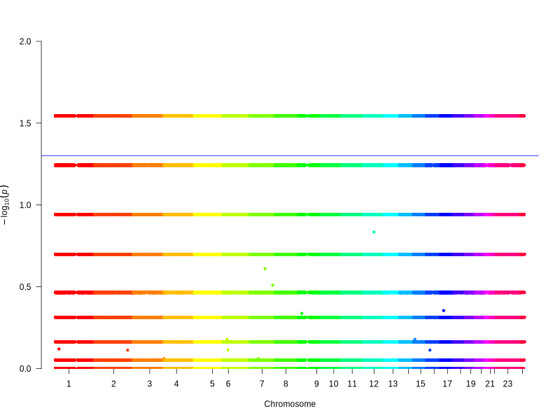
Notice that both the Volcano plot and the Manhattan plot exhibit "stratified" data due to the use of a non-parametric test.

### 12. Heatmap

A heat map displays the methylation levels of CpG sites across multiple samples. Rows represent individual CpG sites, columns represent samples, and the color intensity indicates the degree of methylation (e.g., from unmethylated to fully methylated). Heat maps are useful for visualizing patterns of methylation, identifying clusters of similar samples, and spotting differentially methylated regions.

```r
# Matrix creation
input_heatmap = as.matrix(final_mw[1:100, 1:8])

# Heatmap function
create_heatmap <- function(input_heatmap, group_color, targets, filename, main_title, linkage_method) {
  png(filename = filename, width = 800, height = 600)
  heatmap.2(
    input_heatmap, col = plasma(100), Rowv = TRUE, Colv = TRUE,
    hclustfun = function(x) hclust(x, method = linkage_method),
    dendrogram = "both", key = TRUE, ColSideColors = group_color,
    density.info = "none", trace = "none", scale = "none",
    symm = FALSE, main = main_title,
    key.xlab = 'beta-val', key.title = NA, keysize = 1, labRow = NA
  )
  legend("topright", legend = levels(targets$Group),
         col = c('#CC00CC', '#FF6600'), pch = 19, cex = 0.7)
  dev.off()
}
```
##### 12.1 Complete Linkage
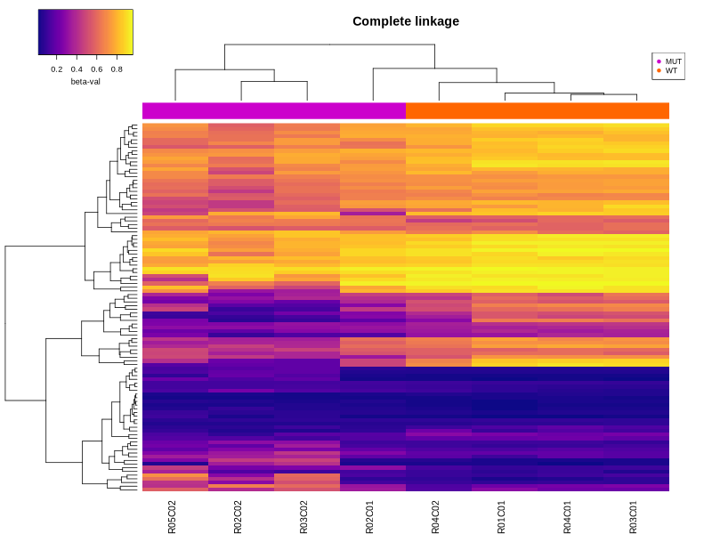
##### 12.2 Single Linkage
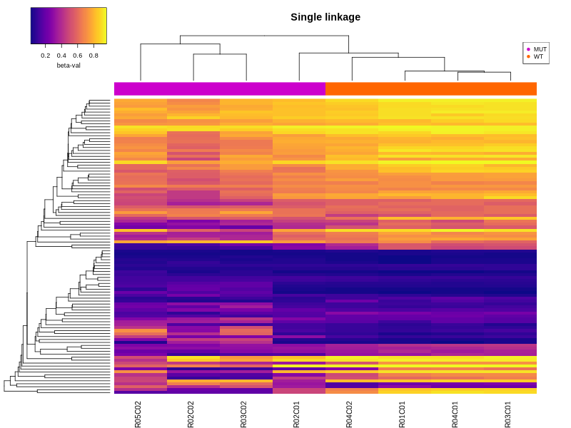
##### 12.3 Average Linkage
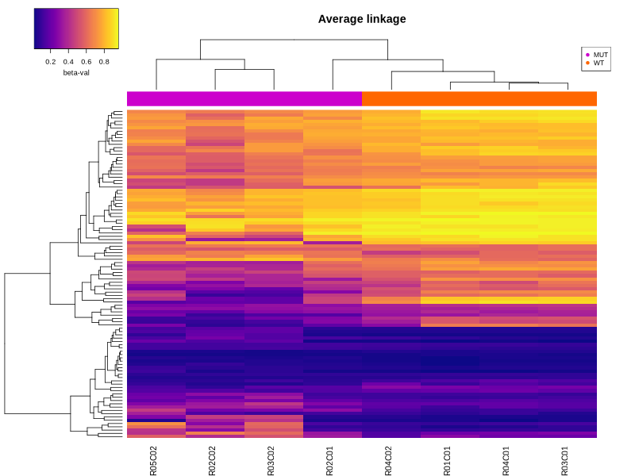

## Conclusions

This project provides a comprehensive analysis of Infinium methylation data, including preprocessing, normalization, visualization, and statistical analysis. The key steps are loading data, defining sample groups, normalizing data, creating informative plots, and performing differential methylation analysis. The analysis reveals differences in methylation patterns between WT and MUT groups, which can be further explored for biological insights.

### Additional Resources
- [minfi package documentation](https://bioconductor.org/packages/release/bioc/html/minfi.html)
- [Infinium Methylation Assay overview](http://support.illumina.com/array/array_kits/infinium_humanmethylation450_beadchip_kit/downloads.html)

By following this guide, you can replicate the analysis and gain insights into methylation patterns in your data.
