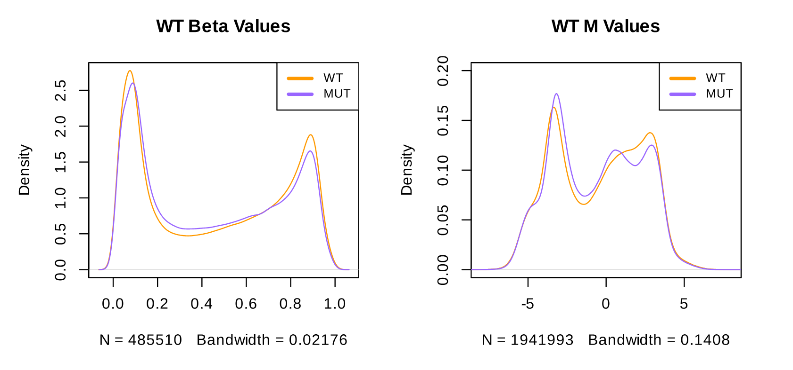

# Infinium Methylation Data Analysis

This project focuses on analyzing Infinium methylation data using R. The workflow includes several steps: loading raw data, preprocessing, normalization, quality checks, visualization, and statistical analysis. Each step is designed to ensure accurate and meaningful results from the methylation data.

## Table of Contents
1. [Introduction](#introduction)
2. [Data Preparation](#data-preparation)
3. [Preprocessing and Normalization](#preprocessing-and-normalization)
4. [Visualization and Analysis](#visualization-and-analysis)
5. [Conclusions](#conclusions)

## Introduction

Methylation analysis is crucial for understanding epigenetic modifications that affect gene expression without changing the DNA sequence. This project uses Infinium methylation arrays to measure DNA methylation at specific CpG sites. The steps include loading raw data, preprocessing, normalization, visualization, and statistical analysis to identify patterns and differences between groups (e.g., wild type (WT) and mutant (MUT)).

## Data Preparation

### 1. Load Raw Data

First, we load the necessary libraries and raw data files. The raw data files include methylation intensity values for different samples.

```r
# Load necessary libraries
library(minfi)
library(knitr)
library(IlluminaHumanMethylation450kmanifest)
library(IlluminaHumanMethylationEPICmanifest)
library(IlluminaHumanMethylationEPICanno.ilm10b2.hg19)

# Load raw data
baseDir <- ('Input')
targets <- read.metharray.sheet(baseDir)
RGset <- read.metharray.exp(targets = targets)
```

### 2. Create R/G Dataframes

The Red and Green signal intensities are stored in separate data frames.

```r
# Create R/G dataframes
Red <- data.frame(getRed(RGset))
dim(Red)
```
```r
## [1] 622399      8
```

```r
Green <- data.frame(getGreen(RGset))
dim(Green)
```
```r
## [1] 622399      8
```

### 3. Check Probe Info by Address

Probe information is essential for identifying and filtering relevant data.

```r
# Check probe info by address
address <- "39802405"

if (address %in% rownames(Red) & address %in% rownames(Green)) 
    Red_fluor <- Red[address, ]
    Green_fluor <- Green[address, ]

load("Illumina450Manifest_clean.RData")
probe_type = Illumina450Manifest_clean[Illumina450Manifest_clean$AddressA_ID==address, 'Infinium_Design_Type']
```
```r
## [1] II
## Levels: I II
```

```r
# Create and fill the fluorescence_data dataframe

fluorescence_data <- data.frame(
  Sample = sapply(strsplit(rownames(fluorescence_data), "_"), `[`, 2),
  Red_fluor = Red_fluor,
  Green_fluor = Green_fluor,
  Type = probe_type
)
rownames(fluorescence_data) <- NULL
```
```r
|Sample | Red_fluor| Green_fluor|Type |
|:------|---------:|-----------:|:----|
|R01C01 |      4254|        8361|II   |
|R02C01 |      4584|       10343|II   |
|R03C01 |      4201|        9859|II   |
|R04C01 |      3627|        8552|II   |
|R02C02 |      5669|        1003|II   |
|R03C02 |      7689|        1041|II   |
|R04C02 |      5954|        6336|II   |
|R05C02 |      5989|         761|II   |
```

### 4. Create the Object MSet.raw

We create the `MSet.raw` object which holds the methylation data.
```r
# Create MSet.raw object
MSet.raw <- preprocessRaw(RGset)
```


## Preprocessing and Normalization

### 5. Quality Check

Quality control is crucial to ensure data integrity. We visualize the control probes and other quality metrics.

##### 5.1 QCplot
```r
# Quality check
qc <- qcReport(RGset, pdf = "QCReport.pdf")
```


##### 5.2 Negative control intensity check
```r
controlStripPlot(RGset, controls="NEGATIVE")
```


##### 5.3 Failed positions
```r
detP <- detectionP(RGset) 
threshold <- 0.05
failed <- detP > threshold
failed_positions <- colSums(failed)

# Summarize failed positions per sample
failed_positions_summary <- data.frame(
  Sample = sapply(strsplit(rownames(failed_positions_summary), "_"), `[`, 2),
  n_Failed_positions = failed_positions
)
```

```r
|Sample | n_Failed_positions|
|:------|------------------:|
|R01C01 |                 45|
|R02C01 |                 26|
|R03C01 |                 28|
|R04C01 |                 32|
|R02C02 |                190|
|R03C02 |                130|
|R04C02 |                 17|
|R05C02 |                406|
```

### 6. Beta and M Values

Beta values represent the proportion of methylation at each CpG site, while M values are logit-transformed beta values.

```r
# Calculate Beta and M values
beta_values <- getBeta(MSet.raw)
M_values <- getM(MSet.raw)
```


### 7. Functional Normalization

Normalization adjusts for technical variation between samples.

```r
# Perform functional normalization
norm_result <- preprocessNoob(RGset)
beta_norm <- getBeta(norm_result)
```

```r
# Filter Infinium I and II data
dfI <- Illumina450Manifest_clean %>% filter(Infinium_Design_Type == "I") %>% droplevels()
dfII <- Illumina450Manifest_clean %>% filter(Infinium_Design_Type == "II") %>% droplevels()

# Get beta values for Infinium I and II
beta <- getBeta(MSet.raw)
beta_I <- beta[rownames(beta) %in% dfI$IlmnID, ]
beta_II <- beta[rownames(beta) %in% dfII$IlmnID, ]

# Remove rows with all NAs
beta_I <- beta_I[rowSums(is.na(beta_I)) != ncol(beta_I), ]
beta_II <- beta_II[rowSums(is.na(beta_II)) != ncol(beta_II), ]

# Calculate densities for raw means and sds
mean_beta_I <- rowMeans(beta_I, na.rm = TRUE)
mean_beta_I <- na.omit(mean_beta_I)
density_mean_beta_I <- density(mean_beta_I)

mean_beta_II <- rowMeans(beta_II, na.rm = TRUE)
mean_beta_II <- na.omit(mean_beta_II)
density_mean_beta_II <- density(mean_beta_II)

sd_beta_I <- apply(beta_I, 1, sd, na.rm = TRUE)
sd_beta_I <- na.omit(sd_beta_I)
density_sd_of_beta_I <- density(sd_beta_I)

sd_beta_II <- apply(beta_II, 1, sd, na.rm = TRUE)
sd_beta_II <- na.omit(sd_beta_II)
density_sd_of_beta_II <- density(sd_beta_II)

# Apply SWAN normalization
RGSet_SWAN <- preprocessSWAN(RGset)

# Get beta values for Infinium I and II after SWAN normalization
beta_SWAN <- getBeta(RGSet_SWAN)
beta_I_SWAN <- beta_SWAN[rownames(beta_SWAN) %in% dfI$IlmnID, ]
beta_II_SWAN <- beta_SWAN[rownames(beta_SWAN) %in% dfII$IlmnID, ]

# Remove rows with all NAs
beta_I_SWAN <- beta_I_SWAN[rowSums(is.na(beta_I_SWAN)) != ncol(beta_I_SWAN), ]
beta_II_SWAN <- beta_II_SWAN[rowSums(is.na(beta_II_SWAN)) != ncol(beta_II_SWAN), ]

# Calculate densities for SWAN means and sds
mean_beta_I_SWAN <- rowMeans(beta_I_SWAN, na.rm = TRUE)
mean_beta_I_SWAN <- na.omit(mean_beta_I_SWAN)
density_mean_beta_I_SWAN <- density(mean_beta_I_SWAN)

mean_beta_II_SWAN <- rowMeans(beta_II_SWAN, na.rm = TRUE)
mean_beta_II_SWAN <- na.omit(mean_beta_II_SWAN)
density_mean_beta_II_SWAN <- density(mean_beta_II_SWAN)

sd_beta_I_SWAN <- apply(beta_I_SWAN, 1, sd, na.rm = TRUE)
sd_beta_I_SWAN <- na.omit(sd_beta_I_SWAN)
density_sd_of_beta_I_SWAN <- density(sd_beta_I_SWAN)

sd_beta_II_SWAN <- apply(beta_II_SWAN, 1, sd, na.rm = TRUE)
sd_beta_II_SWAN <- na.omit(sd_beta_II_SWAN)
density_sd_of_beta_II_SWAN <- density(sd_beta_II_SWAN)
```


### 8. PCA

Principal Component Analysis (PCA) reduces data dimensionality and helps visualize sample clustering.

```r
# Perform PCA
pca_result <- prcomp(t(beta_norm), scale. = TRUE)
plot(pca_result$x[, 1], pca_result$x[, 2], col = ifelse(pheno_data$Group == "WT", "blue", "red"), main = "PCA of Beta Values", xlab = "PC1", ylab = "PC2")
legend("topright", legend = c("WT", "MUT"), col = c("blue", "red"), pch = 1)
```

## Visualization and Analysis

### 9. Differential Methylation Analysis

We identify differentially methylated positions (DMPs) between WT and MUT groups.

```r
# Differential Methylation Analysis
dmp <- dmpFinder(beta_norm, pheno_data$Group, type = "categorical")
```

### 10. Multiple Test Correction

Adjust p-values for multiple testing to control the false discovery rate (FDR).

```r
# Multiple test correction
dmp$adj.P.Val <- p.adjust(dmp$P.Value, method = "BH")
```

### 11. Volcano and Manhattan Plots

Visualize DMPs with volcano and Manhattan plots.

```r
# Volcano plot
volcano <- function(dmp) {
  plot(dmp$logFC, -log10(dmp$adj.P.Val), pch = 20, main = "Volcano Plot", xlab = "Log Fold Change", ylab = "-log10 Adjusted P-value")
  abline(h = -log10(0.05), col = "red")
}
volcano(dmp)

# Manhattan plot
manhattan <- function(dmp) {
  library(qqman)
  dmp$CHR <- as.numeric(factor(dmp$CHR))
  manhattan(dmp, chr = "CHR", bp = "BP", p = "P.Value", main = "Manhattan Plot")
}
manhattan(dmp)
```

### 12. Heatmap

Heatmaps visualize methylation patterns across samples.

```r
# Heatmap
library(pheatmap)
significant_dmp <- dmp[dmp$adj.P.Val < 0.05, ]
pheatmap(beta_norm[rownames(significant_dmp), ])
```

## Conclusions

This project provides a comprehensive analysis of Infinium methylation data, including preprocessing, normalization, visualization, and statistical analysis. The key steps are loading data, defining sample groups, normalizing data, creating informative plots, and performing differential methylation analysis. The analysis reveals differences in methylation patterns between WT and MUT groups, which can be further explored for biological insights.

### Additional Resources
- [minfi package documentation](https://bioconductor.org/packages/release/bioc/html/minfi.html)
- [Infinium Methylation Assay overview](https://www.illumina.com/techniques/microarrays/microarray-kits/infinium-methylation-assay.html)

By following this guide, you can replicate the analysis and gain insights into methylation patterns in your data.
