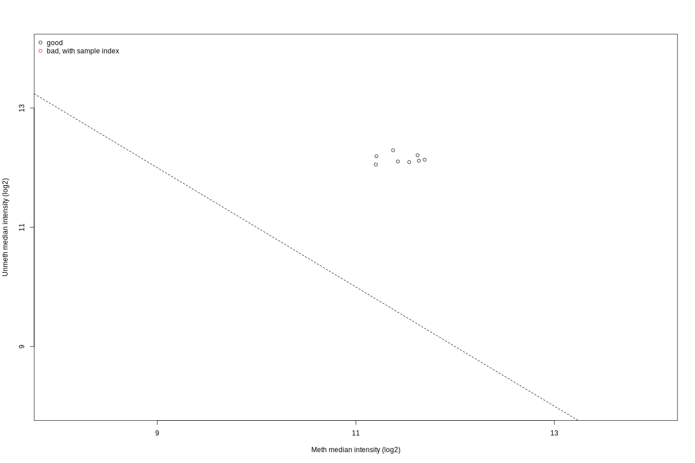
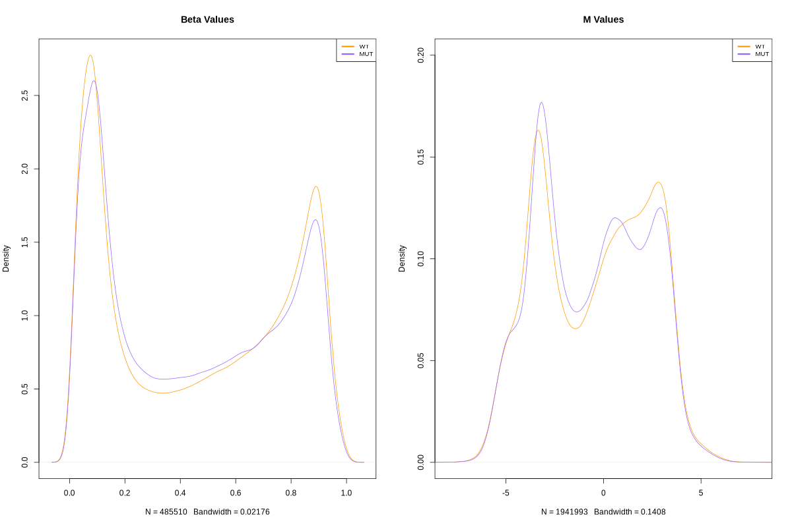
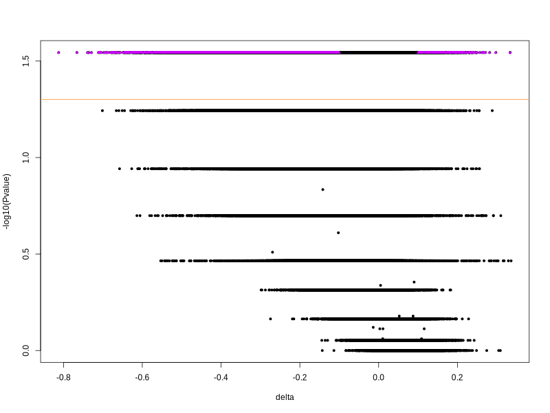

# Infinium Methylation Data Analysis

This project for the exam of DNA/RNA Dynamics focuses on analyzing Infinium methylation data using R.

P.S: in the README file there are going to be code snippets as well as interpretations of the results and various plots; for the complete code please refer at 'R code'.

## Table of Contents
1. [Introduction](#introduction)
2. [Data Preparation](#data-preparation)
3. [Preprocessing and Normalization](#preprocessing-and-normalization)
4. [Visualization and Analysis](#visualization-and-analysis)
5. [Conclusions](#conclusions)

## Introduction

The following pipeline is designed to analyze DNA methylation data from the Illumina HumanMethylation450 BeadChip platform, a popular tool for genome-wide methylation studies. The Infinium assay provides insights into DNA methylation patterns, which are crucial for understanding various biological processes and disease mechanisms.

This repository offers a comprehensive, user-friendly pipeline for processing, analyzing, and interpreting methylation data from the Infinium platform.

### Workflow Overview
*Quality Control:* Assess data quality to identify potential issues or biases.
*Preprocessing:* Apply normalization techniques to reduce technical variations and batch effects.
*Differential Methylation Analysis:* Identify differentially methylated regions (DMRs) or CpG sites associated with specific conditions or phenotypes.
*Visualization:* Create informative plots to visualize DNA methylation patterns and results.

## Data Preparation

### 1. Load Raw Data

Begin by loading the raw data files, which contain intensity values for both methylated and unmethylated probes across samples. This step ensures that the data is correctly formatted for subsequent analyses.

```r
# Load necessary libraries
library(minfi)
library(IlluminaHumanMethylation450kmanifest)
library(IlluminaHumanMethylationEPICmanifest)
library(IlluminaHumanMethylationEPICanno.ilm10b2.hg19)
library(knitr)
library(dplyr)
library(qqman)  
library(gplots)
library(ggplot2)
library(viridis)

# Load raw data
baseDir <- ('Input')
targets <- read.metharray.sheet(baseDir)
RGset <- read.metharray.exp(targets = targets)
```

### 2. Create R/G Dataframes

Separate the raw intensity data into red and green channels. This distinction helps in identifying the chemistry of the probes and is essential for analyzing the fluorescence signals accurately.

```r
# Create R/G dataframes
Red <- data.frame(getRed(RGset))
Green <- data.frame(getGreen(RGset))
dim(Red)            ## [1] 622399      8
dim(Green)          ## [1] 622399      8
```

### 3. Check Probe Info by Address

To determine the probe type, refer to the manifest file from Illumina, which categorizes probes into Type I or Type II. This classification is important because Type II probes use only one color channel, whereas Type I probes use both.

```r
# Check probe info by address
address <- "39802405"
load("Illumina450Manifest_clean.RData")
probe_type = Illumina450Manifest_clean[Illumina450Manifest_clean$AddressA_ID==address, 'Infinium_Design_Type']
```
```r
## [1] II
## Levels: I II
```

```r
# Create and fill the fluorescence_data dataframe

if (address %in% rownames(Red) & address %in% rownames(Green)) 
    Red_fluor <- Red[address, ]
    Green_fluor <- Green[address, ]

fluorescence_data <- data.frame(
  Sample = colnames(Red),
  Red_fluor = Red_fluor,
  Green_fluor = Green_fluor,
  Type = probe_type,
  Color = 'NA'
)
fluorescence_data$Sample <- sapply(strsplit(rownames(fluorescence_data), "_"), `[`, 2)
rownames(fluorescence_data) <- NULL
```

```r
|Sample | Red_fluor| Green_fluor|Type |Color |
|:------|---------:|-----------:|:----|:-----|
|R01C01 |      4254|        8361|II   |NA    |
|R02C01 |      4584|       10343|II   |NA    |
|R03C01 |      4201|        9859|II   |NA    |
|R04C01 |      3627|        8552|II   |NA    |
|R02C02 |      5669|        1003|II   |NA    |
|R03C02 |      7689|        1041|II   |NA    |
|R04C02 |      5954|        6336|II   |NA    |
|R05C02 |      5989|         761|II   |NA    |
```
Notice that the assigned probes are of Infinium II design, hence no color channel needs to be specified since type II probes use a single bead type for both methylated and unmethylated states and measure the intensities of the two states using the same color channel. As a result, Type II probes do not require separate color information for the red or green channels because they are not differentiated by color.

### 4. Create the Object MSet.raw

The `MSet.raw` object contains methylated and unmethylated signal intensities, facilitating further analysis of methylation levels.

```r
# Create MSet.raw object
MSet.raw <- preprocessRaw(RGset)
```

## Preprocessing and Normalization

### 5. Quality Check

QCplot visualizes the median intensities of methylation and unmethylation signals. High median values in both distributions indicate good data quality. However, the plot has limitations, such as not accounting for background signals or potential sample preparation failures.

##### 5.1 QCplot

The plot shows clustering of samples with high median values, indicating good quality data. Low median values suggest poor quality, which can affect downstream analyses.

```r
# Quality check
qc <- getQC(MSet.raw)
plotQC(qc)
```


##### 5.2 Negative control intensity check

Negative control probes estimate system background intensity. Normally, these values range from 100 to 1000 units. High values may indicate degraded DNA, affecting data quality. Using controlStripPlot(), we can check the intensity levels, with higher values indicating potential issues.

```r
controlStripPlot(RGset, controls="NEGATIVE")
```


##### 5.3 Failed positions
```r
# Calculate detection pValues
detP <- detectionP(RGset) 
threshold <- 0.05
failed <- detP > threshold
failed_positions <- colSums(failed)

# Summarize failed positions per sample
failed_positions_summary <- data.frame(
  Sample = colnames(failed),
  n_Failed_positions = colSums(failed),
  percentage_failed = colMeans(failed)*100
)
failed_positions_summary$Sample <- sapply(strsplit(rownames(failed_positions_summary), "_"), `[`, 2)
rownames(failed_positions_summary) <- NULL

kable(failed_positions_summary)
```

```r
|Sample | n_Failed_positions| percentage_failed|
|:------|------------------:|-----------------:|
|R01C01 |                 45|         0.0092686|
|R02C01 |                 26|         0.0053552|
|R03C01 |                 28|         0.0057671|
|R04C01 |                 32|         0.0065910|
|R02C02 |                190|         0.0391339|
|R03C02 |                130|         0.0267759|
|R04C02 |                 17|         0.0035015|
|R05C02 |                406|         0.0836231|
```

### 6. Beta and M Values

Beta values represent the proportion of methylation at each CpG site, while M values are logit-transformed beta values.

```r
# Calculate Beta and M values
beta <- getBeta(MSet.raw)
M <- getM(MSet.raw)
```


### 7. Functional Normalization

Normalization adjusts for technical variation between samples.

```r
# Apply SWAN normalization
RGSet_SWAN <- preprocessSWAN(RGset)
beta_SWAN <- getBeta(RGSet_SWAN)
```

```r
# Filter Infinium I and II data
dfI <- Illumina450Manifest_clean %>% filter(Infinium_Design_Type == "I") %>% droplevels()
dfII <- Illumina450Manifest_clean %>% filter(Infinium_Design_Type == "II") %>% droplevels()
```


### 8. PCA

Principal Component Analysis (PCA) reduces data dimensionality and helps visualize sample clustering.

```r
# Perform PCA
pca_results <- prcomp(t(beta_SWAN), scale. = TRUE)
```


```r
var_explained <- pca_results$sdev^2 / sum(pca_results$sdev^2) * 100

eig_df <- data.frame(
  PC = seq_along(var_explained),
  Variance = var_explained
)
```


## Visualization and Analysis

### 9. Differential Methylation Analysis

We identify differentially methylated positions (DMPs) between WT and MUT groups.

```r
# Define the Mann-Whitney test function
mann_whitney_function <- function(x) {
  mw_test <- wilcox.test(x ~ samplesheet$Group)
  return(mw_test$p.value)
}

# Apply the Mann-Whitney test function to each row
pValues_mw <- apply(beta_SWAN, 1, mann_whitney_function)

# Create a data frame with beta_SWAN values and p-values
final_mw <- data.frame(beta_SWAN, pValues_mw)
final_mw <- final_mw[order(final_mw$pValues_mw),]

kable(head(final_mw))
```

```r
|           |    R01C01|    R02C01|    R03C01|    R04C01|    R02C02|    R03C02|    R04C02|    R05C02| pValues_mw|
|:----------|---------:|---------:|---------:|---------:|---------:|---------:|---------:|---------:|----------:|
|cg00213748 | 0.2817402| 0.3407055| 0.2067676| 0.2236526| 0.4028662| 0.5231608| 0.1565621| 0.5665209|  0.0285714|
|cg03695421 | 0.6034216| 0.5274061| 0.5557625| 0.6064900| 0.3585165| 0.3829868| 0.5724094| 0.4791914|  0.0285714|
|cg03750315 | 0.0376477| 0.0840457| 0.0790058| 0.0486865| 0.4055088| 0.5794807| 0.0835519| 0.6151685|  0.0285714|
|cg04462340 | 0.5819596| 0.6274705| 0.6153685| 0.5920996| 0.6508689| 0.7705017| 0.5705601| 0.7360328|  0.0285714|
|cg05865243 | 0.9349324| 0.8893957| 0.9298641| 0.9289065| 0.8537726| 0.7612493| 0.9139275| 0.4217573|  0.0285714|
|cg07939587 | 0.9095799| 0.8335510| 0.9359694| 0.9051271| 0.9045411| 0.7254902| 0.9313836| 0.5163043|  0.0285714|
```


### 10. Multiple Test Correction

Adjust p-values for multiple testing to control the false discovery rate (FDR).

```r
# Multiple test correction
corr_pValues_Bonf <- p.adjust(final_mw$pValues_mw, "bonferroni")
corr_pValues_BH <- p.adjust(final_mw$pValues_mw, "BH")
final_mw_corr <- data.frame(final_mw, corr_pValues_Bonf, corr_pValues_BH)

before_corr <- nrow(final_mw[final_mw$pValues_mw <= 0.05,])
after_Bonf <- nrow(final_mw[final_mw$corr_pValues_Bonf <= 0.05,])
after_BH <- nrow(final_mw_corr[final_mw_corr$corr_pValues_BH <= 0.05,])

diff_meth_probes <- data.frame(before_corr, after_Bonf, after_BH)
rownames(diff_meth_probes) <- c("Differentially methylated probes")

kable(diff_meth_probes)
```

```r
|                                 | before_corr| after_Bonf| after_BH|
|:--------------------------------|-----------:|----------:|--------:|
|Differentially methylated probes |       53343|          0|        0|
```


### 11. Volcano and Manhattan Plots

Visualize DMPs with volcano and Manhattan plots.

##### 11.1 Volcano plot
```r
# WT and MUT group means
WT_group <- final_mw_corr[, targets$Group == "WT"]
MUT_group <- final_mw_corr[, targets$Group == "MUT"]
mean_WT_group <- apply(WT_group, 1, mean)
mean_MUT_group <- apply(MUT_group, 1, mean)

# Compute delta
delta <- mean_WT_group - mean_MUT_group

#create a dataframe
toVolcPlot <- data.frame(delta, -log10(final_mw_corr$pValues_mw))
kable(head(toVolcPlot))
```

```r
|           |      delta| X.log10.final_mw_corr.pValues_mw.|
|:----------|----------:|---------------------------------:|
|cg00213748 | -0.3737603|                          1.544068|
|cg03695421 | -0.1118362|                          1.544068|
|cg03750315 | -0.4472554|                          1.544068|
|cg04462340 | -0.3155401|                          1.544068|
|cg05865243 | -0.1191932|                          1.544068|
|cg07939587 | -0.1341973|                          1.544068|
```


##### 11.2 Manhattan Plot
```r
final_mw_corr_df <- data.frame(IlmnID = rownames(final_mw_corr), final_mw_corr)
final_mw_corr_ann <- merge(final_mw_corr_df, Illumina450Manifest_clean, by = "IlmnID")

input_Manhattan <- data.frame(id = final_mw_corr_ann$IlmnID, 
                              chr = final_mw_corr_ann$CHR, 
                              map = final_mw_corr_ann$MAPINFO, 
                              pval = final_mw_corr_ann$pValues_mw)
kable(head(input_Manhattan))
```
```r
|id         | chr|       map|      pval|
|:----------|---:|---------:|---------:|
|cg00000029 |  16|  53468112| 0.0285714|
|cg00000108 |   3|  37459206| 0.1142857|
|cg00000109 |   3| 171916037| 0.1142857|
|cg00000165 |   1|  91194674| 0.3428571|
|cg00000236 |   8|  42263294| 0.8857143|
|cg00000289 |  14|  69341139| 0.4857143|
```


### 12. Heatmap

Heatmaps visualize methylation patterns across samples.

```r
# Matrix creation
input_heatmap = as.matrix(final_mw[1:100, 1:8])

# Heatmap function
create_heatmap <- function(input_heatmap, group_color, targets, filename, main_title, linkage_method) {
  png(filename = filename, width = 800, height = 600)
  heatmap.2(
    input_heatmap, col = plasma(100), Rowv = TRUE, Colv = TRUE,
    hclustfun = function(x) hclust(x, method = linkage_method),
    dendrogram = "both", key = TRUE, ColSideColors = group_color,
    density.info = "none", trace = "none", scale = "none",
    symm = FALSE, main = main_title,
    key.xlab = 'beta-val', key.title = NA, keysize = 1, labRow = NA
  )
  legend("topright", legend = levels(targets$Group),
         col = c('#CC00CC', '#FF6600'), pch = 19, cex = 0.7)
  dev.off()
}
```
##### 12.1 Complete Linkage

##### 12.2 Single Linkage

##### 12.3 Average Linkage


## Conclusions

This project provides a comprehensive analysis of Infinium methylation data, including preprocessing, normalization, visualization, and statistical analysis. The key steps are loading data, defining sample groups, normalizing data, creating informative plots, and performing differential methylation analysis. The analysis reveals differences in methylation patterns between WT and MUT groups, which can be further explored for biological insights.

### Additional Resources
- [minfi package documentation](https://bioconductor.org/packages/release/bioc/html/minfi.html)
- [Infinium Methylation Assay overview](https://www.illumina.com/techniques/microarrays/microarray-kits/infinium-methylation-assay.html)

By following this guide, you can replicate the analysis and gain insights into methylation patterns in your data.
